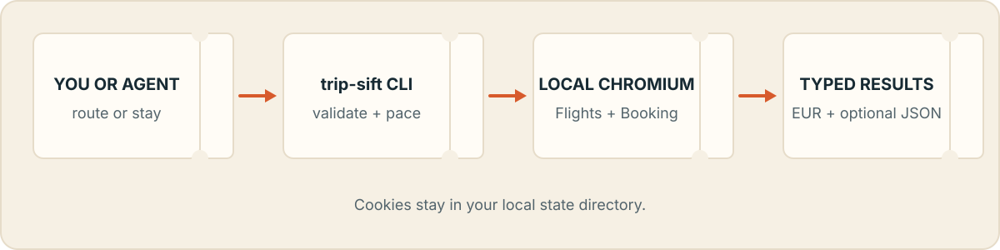

<p align="center">
  
</p>

<p align="center">
  
  
  
  
</p>

`trip-sift` searches one-way economy flights through local Chromium and returns EUR prices with raw and normalized fields for each offer. Searches use Spanish (`es-ES`) locale data. It uses [fast-flights](https://pypi.org/project/fast-flights/) and Playwright on your machine.

This is an unofficial project with no affiliation to Google. Google can change markup at any time, which may break parsing. Review the [Google Terms of Service](https://policies.google.com/terms) and your own obligations before use.

## Install

```bash
python3.9 -m venv .venv
.venv/bin/python -m pip install -e .
.venv/bin/playwright install chromium
```

Requires Python 3.9 or newer. After these steps, the `trip-sift` CLI is available in `.venv/bin/`.

## Search one route

```bash
.venv/bin/trip-sift flights MAD-BCN:2026-09-01
```

Prints up to eight eligible offers in a table. No result file is created.

## At a glance

| Capability | Behavior |
|---|---|
| Multiple dates | Expands comma-separated dates and searches sequentially. |
| Stops | Supports direct flights or at most one stop. |
| Output | Prints a table and writes JSON only with `--save`. |
| Rate limits | Keeps fixed delays, jitter, and exponential backoff. |
| Privacy | Stores browser state outside the checkout. |

## How it works

<p align="center">
  
</p>

## Compare dates and save JSON

```bash
.venv/bin/trip-sift flights \
  MAD-BCN:2026-09-01,2026-09-02,2026-09-03 \
  --max-stops 0 \
  --top 5 \
  --save results/search.trip-sift.json
```

Searches each date sequentially, prints a table per date, and writes combined results to `results/search.trip-sift.json`.

Route grammar: `ORIGIN-DESTINATION:DATE[,DATE...]` with three-letter IATA codes and `YYYY-MM-DD` dates.

## Python API

```python
from datetime import date

from trip_sift import FlightQuery, search_flights

report = search_flights(
    [
        FlightQuery(
            origin="MAD",
            destination="BCN",
            departure_date=date(2026, 9, 1),
            max_stops=1,
        )
    ],
    top=5,
)

for result in report.queries:
    if result.status == "ok":
        for offer in result.offers:
            print(offer.price_eur, offer.airline)
```

## Baggage

Low-cost carriers include a 70 EUR baggage buffer in ranking. That is an estimate, not a fare quote. Confirm checked-bag rules and price on Google Flights before booking.

## Browser state

Playwright consent cookies persist at:

1. `$TRIP_SIFT_STATE_DIR/pw_state_google.json`
2. `$XDG_STATE_HOME/trip-sift/pw_state_google.json`
3. `~/.local/state/trip-sift/pw_state_google.json`

Delete that file if consent or scraping breaks; it will be recreated on the next run.

## Rate limits

If searches start failing repeatedly, stop for 30-60 minutes before trying again with a small query set.

## Exit codes

| Code | Meaning |
|------|---------|
| `0` | Every query completed. |
| `1` | The command input is invalid. |
| `2` | Every query failed. |
| `3` | Some queries completed and some failed. |

## Tests

```bash
PYTHONPATH=src python3 -m unittest discover -s tests -v
```

## Privacy boundary

Browser state, saved results, logs, Playwright artifacts, and local scratch files are excluded by `.gitignore`. Inspect `git status --short` and `git ls-files` before pushing a fork.
