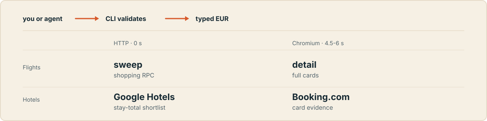

<p align="center">
  
</p>

<p align="center">
  
  
</p>

Compare flight and hotel prices in EUR from your own machine, with no API keys and no account. Flights have two fetch modes: **sweep** is a fast HTTP shortlist (owned shopping RPC, Chrome TLS session, HTML fallback), **detail** is the Playwright scrape for max evidence. Hotels default to a local Chromium on Booking.com; `--source google` is a no-Chromium shortlist. Offers keep the scraped text next to every parsed number. Query encoding and card parsing are owned by viajante. It is built for scripts and agents that need structured prices, not for browsing.

The name is Spanish for the travelling salesman: shortlist routes, don't brute-force every combination.

This is an unofficial project with no affiliation to Google or Booking.com. Either provider can change markup at any time, which may break parsing. Review the [Google Terms of Service](https://policies.google.com/terms), [Booking.com terms](https://www.booking.com/content/terms.html), and your own obligations before use.

## Install

Needs [uv](https://docs.astral.sh/uv/) and Python 3.10 or newer.

```bash
uv sync
uv run playwright install chromium
```

After that, run the CLI with `uv run viajante`. The lockfile (`uv.lock`) pins the exact dependency graph used in CI. A plain `pip install -e .` still works if you prefer pip, but then you must install Chromium yourself and you lose the locked transitive versions. Agents that want the stdio MCP server can add the extra: `uv sync --extra mcp`, then `uv run viajante-mcp`.

## Search flights

```bash
uv run viajante flights MAD-BCN:2026-09-01 --fetch sweep
```

```text
=== MAD -> BCN  2026-09-01 (max 1 stop(s)) ===
       88 €  1 hr 20 min  direct  09:30 -> 10:50     Iberia
       39 €      109 € ranked  1 hr 25 min  direct  07:15 -> 08:40     Vueling
      131 €  3 hr 55 min  1 stop  14:05 -> 18:00     Air Europa
```

One adult, one-way, economy. Up to eight offers per query, ordered by ranked total (fare plus baggage buffer). Vueling is cheaper on fare, but the buffer puts it behind Iberia at 109 € ranked. Pass `--sort fare` to order by cabin fare, `--sort duration` to order by elapsed time, or `--baggage-buffer 0` to rank on fare alone. `--airlines IB,I2`, `--exclude-airlines FR,RK`, `--depart-window 7-12`, `--max-duration 4`, and `--min-layover 1` are local post-filters applied after parse and before `--top`. `MAD-OPO:2026-10-09:2026-10-12` expands to outbound plus return as two one-way queries. `--trip rt ORIGIN-DEST:OUT:BACK` POSTs one native package instead. The sugar without `--trip` stays two one-ways. `--fetch sweep` is the fast HTTP shortlist: one Chrome TLS session, owned shopping RPC, HTML card parse only if that misses (no Chromium). `--fetch detail` is the full Playwright scrape. `--fetch auto` (default) uses sweep for 3+ queries and detail for 1–2; if sweep comes back empty, blocked, or markup-drifted, viajante falls back to detail once. Nothing is written to disk unless you ask for it.

## Cheapest days

```bash
uv run viajante dates MAD-LHR --from 2026-09-01 --to 2026-09-30
```

```text
=== MAD -> LHR  2026-09-01 .. 2026-09-30 ===
  2026-09-01       81 €
  2026-09-02       81 €
  2026-09-03       67 €
```

One compact table: date → cheapest EUR. The window is at most 31 days. This uses the owned Google Flights date-grid RPC on the same Chrome TLS session as sweep, not N full offer dumps. Airline and stops are omitted when the calendar body does not carry them. If that compact calendar parse misses, viajante prices each day with the shopping sweep and still prints one row per date (`fetch_backend: sweep`). `--fetch sweep` is accepted; `detail` is ignored because this command is HTTP-only.

## Cheap destinations

```bash
uv run viajante explore MAD --from 2026-09-01 --days 7
```

```text
=== From MAD  2026-09-01  (7-day window) ===
       28 €  OPO  Porto  Portugal
       61 €  LIS  Lisbon  Portugal
```

Explore asks Google for destinations from one origin, then prices a `--top` shortlist (default 12) with the shopping RPC on `--from`. `--month 2026-09` uses the first of that month. This is the “surprise me from MAD” list, not a brute-force airport matrix.

## Airport lookup

```bash
uv run viajante airports london
uv run viajante airports MAD
```

Offline IATA search. `FlightQuery` rejects unknown codes (`XXX` is not an airport). Known three-letter codes still work.

## Search hotels

```bash
uv run viajante hotels Prague 2026-12-04 2026-12-07 --min-rating 8.5
```

```text
=== Prague  2026-12-04 -> 2026-12-07 (3 nights, 2 adult(s), 1 room(s)) ===
  Filters: Free cancellation required; Minimum rating 8.5
  Booking chips: oos=1
  246 € total stay  rating 8.9  Hotel Golden Key  Praga 1
    Cancellation: free
    Lodging: hotel
  291 € total stay  rating 9.2  Vinohrady Apartment  Praga 2
    Cancellation: free
    Lodging: entire home
    2 bedrooms, 1 bathroom, 3 beds
  Raw cards: 40; eligible: 12; shown: 2
```

Prices are totals for the whole stay, not per night. Free cancellation is required by default; use `--allow-non-refundable` only when you explicitly want other stays. `--compare-cancellation` runs two sequential Booking searches (with the free-cancellation chip, then without) and prints a joined price table; do not combine it with `--allow-non-refundable` or `--source google`. `--source google` POSTs the owned hotel RPC on a Chrome TLS session (locale `en`, 5-star ratings, no Chromium). `--min-rating` above 5 is rejected on that source. Default `--source booking` stays the Playwright path.

The CLI does not scrape Kayak, Lastminute, or official hotel sites. For a second opinion on 1–3 finalists, an agent can use the user's browser to Google the property and list whatever sources show up (official site, aggregators, others) without ranking them; those quotes stay outside `--save` JSON.

The output separates what you asked for (`Filters`), what Booking was actually told (`Booking chips`), and what each card actually showed (`Cancellation`, `Lodging`, beds), because those can disagree. Note that `--min-rating 8.5` appears under `Filters` but produces no chip: only free cancellation and `--entire-home` are pushed to Booking, and the rating is applied locally to the scraped cards.

## How it works

<p align="center">
  
</p>

You or an agent pass a route and dates. The CLI validates the input before any browser starts. A 3+ query flight batch uses HTTP sweep by default: one keep-alive Chrome TLS/HTTP/2 session, compact shopping parse, no 4.5s pause between legs. One or two flight queries, `--fetch detail`, or a sweep fallback uses one local Chromium session with images, media, and fonts blocked. Offers come back ranked, and consent cookies stay in your state directory rather than in this checkout.

## Compare dates and save JSON

For a cheapest-per-day grid, prefer `viajante dates` (31-day cap, one row per date). A comma list still dumps full offer blocks when you need the cards:

```bash
uv run viajante dates MAD-BCN --from 2026-09-01 --to 2026-09-14 --save results/dates.viajante.json
uv run viajante flights \
  MAD-BCN:2026-09-01,2026-09-02,2026-09-03 \
  --max-stops 0 \
  --top 5 \
  --save results/search.viajante.json
```

Each `flights` date is searched sequentially and printed as its own block. Progress goes to stderr so you can pipe the table on its own. A 10-date sweep is a few seconds of HTTP. The same batch on `--fetch detail` still sleeps 4.5 to 6 seconds between queries on purpose.

## CLI reference

Flight route grammar is `ORIGIN-DESTINATION:DATE[,DATE...]` with three-letter IATA codes and `YYYY-MM-DD` dates, or `ORIGIN-DESTINATION:OUT:BACK` for outbound plus return as two one-way searches. `--trip rt` on that same token is one package fare. The sugar without `--trip` stays two one-ways. Codes are case-insensitive. You can still pass a return leg as a second route.

| `flights` flag | Default | Behavior |
|---|---|---|
| `--max-stops` | `1` | `0` for direct flights only, `1` to allow one stop. |
| `--adults` | `1` | Number of adults on the search. |
| `--cabin` | `economy` | `economy`, `premium-economy`, `business`, or `first`. |
| `--top` | `8` | Offers kept per query after ranking and deduplication. |
| `--baggage-buffer` | `70` | EUR added to low-cost fares when ranking. `0` ranks on fare alone. |
| `--sort` | `ranked` | `ranked` uses fare+buffer for `--top`; `fare` uses cabin fare; `duration` uses elapsed time. |
| `--airlines` | off | Keep only these airline IATA codes (`IB,I2`). Applied after parse, before `--top`. |
| `--exclude-airlines` | off | Drop these airline IATA codes (`FR,RK`). |
| `--depart-window` | off | Keep local departure hours in `START-END` inclusive (`6-20`). |
| `--fetch` | `auto` | `sweep` = owned shopping RPC, Chrome TLS session, HTML fallback; `detail` = Playwright max evidence. `auto` picks sweep for 3+ queries, detail for 1–2. |
| `--max-layover` | off | Drop 1-stop offers whose layover exceeds this many hours. Nonstops are kept. |
| `--min-layover` | off | Drop 1-stop offers whose layover is shorter than this many hours. Nonstops are kept. |
| `--max-duration` | off | Drop offers whose elapsed time exceeds this many hours. |
| `--save FILE` | off | Write the JSON report atomically. |

| `dates` flag | Default | Behavior |
|---|---|---|
| `--from` / `--to` | required | Inclusive departure window. Cap is 31 days. |
| `--max-stops` / `--adults` / `--cabin` | `1` / `1` / `economy` | Same meaning as `flights`. |
| `--fetch` | `sweep` | Calendar uses the date-grid RPC. On a compact miss, each day is priced with shopping sweep. `detail` is accepted and ignored. |
| `--save FILE` | off | Write the calendar JSON atomically. |

| `explore` flag | Default | Behavior |
|---|---|---|
| `--from` / `--days` | date / `7` | Outbound date and trip-window label. |
| `--month` | off | First of `YYYY-MM` plus that month's length. Do not combine with `--from`. |
| `--top` | `12` | Destinations to price after the explore catalog. |
| `--save FILE` | off | Write the explore JSON atomically. |

| `hotels` flag | Default | Behavior |
|---|---|---|
| `--source` | `booking` | `booking` is Playwright. `google` is the HTTP shortlist. No hotel `--fetch`. |
| `--adults` / `--rooms` | `2` / `1` | Occupancy for the stay. |
| `--top` | `8` | Stays shown after filtering and ranking. |
| `--min-rating` | off | Local score filter. Booking is 0-10. `--source google` is 0-5. |
| `--entire-home` | off | Require entire homes. Cards with unknown property type may remain. |
| `--allow-non-refundable` | off | Include stays without free cancellation. |
| `--compare-cancellation` | off | Two sequential Booking searches and a joined price table. Not with `--source google`. |
| `--save FILE` | off | Write the JSON report atomically. |

| Exit code | Meaning |
|---|---|
| `0` | Every query finished without a fetch failure, including queries that found nothing eligible. |
| `1` | The command input is invalid. |
| `2` | Every query failed. |
| `3` | Some queries finished and some failed. |

## JSON output

`--save` writes one report per run. Every offer carries the scraped text beside its parsed value, so a better parser can be run over old results.

```json
{
  "schema_version": 1,
  "searched_at": "2026-08-11T10:32:00Z",
  "currency": "EUR",
  "locale": "en",
  "fetch_backend": "sweep",
  "fetch_ms": 2410,
  "queries": [
    {
      "status": "ok",
      "query": {
        "origin": "MAD",
        "destination": "BCN",
        "departure_date": "2026-09-01",
        "max_stops": 1,
        "adults": 1,
        "cabin": "economy"
      },
      "raw_count": 24,
      "eligible_count": 1,
      "offers": [
        {
          "airline": "Vueling",
          "departure": "07:15",
          "arrival": "08:40",
          "price": "€39",
          "price_eur": 39.0,
          "duration": "1 hr 25 min",
          "duration_hours": 1.42,
          "stops": "Nonstop",
          "stops_count": 0,
          "layover_city": null,
          "layover_hours": null,
          "flight_numbers": ["VY1001"],
          "booking_token": "tok",
          "baggage_buffer_eur": 70,
          "needs_bag_verify": true
        }
      ]
    }
  ]
}
```

A failed query replaces `raw_count`, `eligible_count`, and `offers` with `"error": {"code": ..., "message": ...}`. Codes an agent can switch on: `no_results`, `rejected`, `blocked`, `markup_drift`, `fetch_failed`, `browser_unavailable`. Hotel reports follow the same envelope, with `provider` (`booking.com` or `google-hotels`), `price_basis: "total_stay"`, and an `applied` block recording the filters that were actually sent. `flight_numbers` and `booking_token` are present when the compact shopping body has them; otherwise they are `null`. No booking flow. Do not invent CO2.

## Python API

```python
from datetime import date

from viajante import FlightQuery, search_flights

report = search_flights(
    [
        FlightQuery(
            origin="MAD",
            destination="BCN",
            departure_date=date(2026, 9, 1),
            max_stops=1,
        )
    ],
    top=5,
    fetch="sweep",
)

for result in report.queries:
    if result.status == "ok":
        for offer in result.offers:
            print(offer.price_eur, offer.airline)
```

Hotels use the same report pattern:

```python
from datetime import date

from viajante import HotelQuery, search_hotels

report = search_hotels(
    [
        HotelQuery(
            location="Prague",
            check_in=date(2026, 12, 4),
            check_out=date(2026, 12, 7),
        )
    ],
    top=5,
)

for result in report.queries:
    if result.status == "ok":
        for offer in result.offers:
            print(offer.total_price_eur, offer.title)
```

`search_flights(..., fetch="auto")` matches the CLI. Sweep does not start Chromium. Hotels still use the same Chromium pacing as the CLI. `search_dates`, `search_explore`, and `lookup_airports` are the same surfaces as the `dates`, `explore`, and `airports` commands.

## Limitations

- Flights are one-way only, and `--max-stops` is `0` or `1`. Adults and cabin are configurable (`--adults`, `--cabin`). Sweep does not use the 4.5s browser delay. There is no flag to shorten detail delays or to parallelize requests.
- The flight scrape runs in English (`hl=en`) for stable rendered evidence; prices are still EUR. Hotels scrape in Spanish against our own parser.
- Flight ranking adds a flat estimate for known low-cost carriers, not a fare quote. The low-cost list is partial, so an airline missing from it is not evidence of a bag-inclusive fare. Confirm the checked bag on Google Flights before booking.
- Hotel cancellation, lodging kind, and bed counts are reported as observed evidence, and `unknown` means the card did not say. `--entire-home` therefore cannot remove every non-home. Confirm the final total and the cancellation terms on Booking.com before booking.
- Finding nothing eligible still exits `0` and prints `(no eligible offers)` or `(no eligible stays)`. Widen the filters or check the route.
- If Chromium is missing you get `browser_unavailable`. Run `uv run playwright install chromium`.
- After repeated failures, stop for 30 to 60 minutes and retry a small query set.

## Browser state

Playwright consent cookies persist as `pw_state_google.json` and `pw_state_booking.json` at the first of these that applies:

1. `$VIAJANTE_STATE_DIR/`
2. `$XDG_STATE_HOME/viajante/`
3. `~/.local/state/viajante/`

Delete the affected provider file if consent or scraping breaks. It is recreated on the next run.

## Tests

```bash
uv run python -m unittest discover -s tests -v
uv run ruff check src tests
```

Fully offline. They never launch Chromium and never touch the network. `tests/test_google_flights.py` pins query encoding and drives synthetic compact shopping bodies plus HTML markup through the owned parsers. CI runs the suite on Python 3.10 through 3.14.

## Privacy boundary

This tree is the public export of a private trip-planning repo. Do not commit scrapes, personal routes, or browser session files. Saved results (`results/`, `*.viajante.json`), logs, and Playwright artifacts are gitignored, and consent cookies live outside the checkout entirely. Before pushing a fork, check `git status --short` and `git ls-files`.
